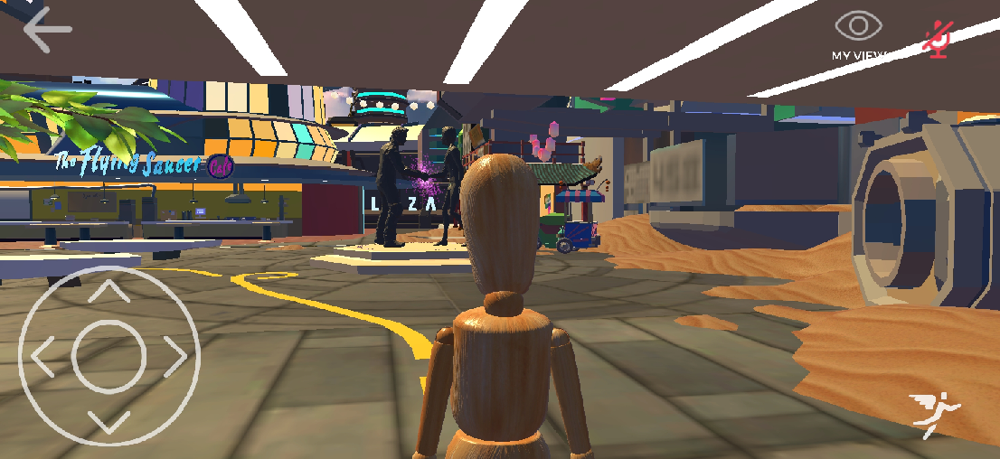

An unreleased version of High Fidelity is currently [available to download](https://play.google.com/store/apps/details?id=io.highfidelity.hifiinterface) for Daydream-enabled Android devices.
 
>>>> Compatibility: The app is designed for Daydream-ready phones only. However, it cannot be used in Daydream View and is only available as a 2d application.
 
As an unreleased app, it does not have the full functionality of the desktop or VR version of High Fidelity. However, you are able to explore a number of worlds, attend events, change avatars, and connect with friends directly from your phone.
 
**On This Page**
* [Visit Different Worlds](#visit-worlds)
* [Movement Controls](#movement-controls)
* [Additional Controls](#additional-controls)
* [Avatar Controls](#avatar-controls)
* [Discover and Make Friends](#discover-and-make-friends)

## Visit Different Worlds
* We have modified several of High Fidelity's most popular domains to make them more accessible for Android users
* Under the **Home** tab in the menu, users will find the domains we have optimized for Android

  

## Movement Controls
* **Walking** - When exploring a domain, use the arrows in the bottom left corner to turn and/or walk 
* **Turning** - Drag your finger left or right across the screen to make your avatar turn
* **Look up/down** - Drag your finger up or down to change the angle of the camera
* **Flying** - Press the button on the bottom right with the winged avatar to fly (the longer you hold it, the higher you go!)

## Additional Controls
* **View** - Switch to a bird's eye view camera by pressing the **My View** button in the top right of the screen
* **Mute** - Your avatar in muted by default when you open the app, simply press the mic button in the top right to unmute

## Avatar Controls
* **Change Your Avatar** - From the **Avatar** tab in the menu, you can switch your avatar to one from the pre-selected list
* **Set Display Name** - From the **Avatar** tab, you can set a display name

## Discover and Make Friends
* **Handshake** - In High Fidelity, you can add people to your connections list by shaking their hand. To shake hands using the Android app press the handshake button above the flight button in the bottom right of the screen
* **Connections List** - Open the **People** tab form the menu to view the friends you've made

Additional functionality such as opening the tablet, create/edit mode, adding wearables, etc. are not available.
 
 
 
 
 
 
 
 
 
 
 
 
