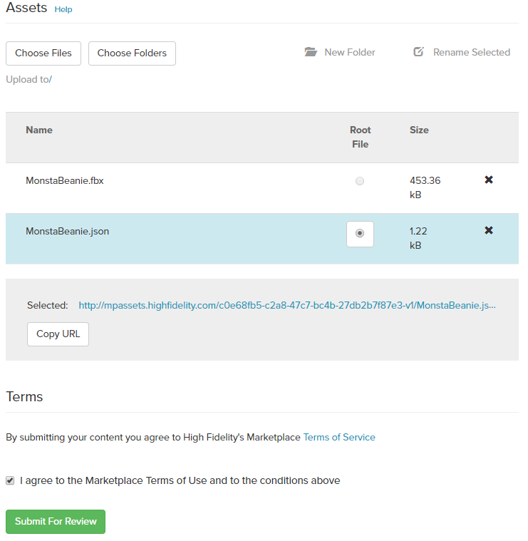

## Overview

High Fidelity allows users to create wearables for their avatar, which can include hats, glasses, and even companion pets can be uploaded as a wearable. Wearables attach to avatars through a JSON file that fixes the wearable to a specific joint. In this tutorial, we will walk you through how to edit, upload, and sell a wearable.

There are 5 steps to create and upload your own wearable:
##### 1. [Create 3D model in an external program and export](https://docs.highfidelity.com/high-fidelity-commerce/createandsellwearables#1-create-3d-model-in-an-external-program-and-export-1)
##### 2. [Import the model in-world](https://docs.highfidelity.com/high-fidelity-commerce/avatar-wearables/createandsellwearables#2-import-the-model-in-world-1)
##### 3. [Edit the wearable](https://docs.highfidelity.com/high-fidelity-commerce/avatar-wearables/createandsellwearables#3-edit-the-wearable-1)
##### 4. [Generate a JSON to add to the Marketplace](https://docs.highfidelity.com/high-fidelity-commerce/avatar-wearables/createandsellwearables#4-generate-a-json-to-add-to-the-marketplace-1)
##### 5. [Upload the model to the Marketplace](https://docs.highfidelity.com/high-fidelity-commerce/avatar-wearables/createandsellwearables#5-upload-the-model-to-the-marketplace-1)

### 1. Create 3D model in an external program and export
The first step in creating your wearable is creating or finding a model you want to upload. 

There are a few different applications you can use to manipulate and edit your 3D model, including:
* [Blender](https://www.blender.org/)
* [Google Blocks](https://vr.google.com/blocks/)
* [Maya](https://www.autodesk.com/products/maya/overview)
* [Oculus’ Medium](https://www.oculus.com/medium/)
* [Tiltbrush](https://www.tiltbrush.com/)

For our example, we used Blender. 


Once you're done editing your model, export the file as an .fbx or .obj.
### 2. Import the model in-world
You can import the model into High Fidelity two ways: Using a Hosting Service or Using Your Asset Server.
1. Using a Hosting Service:
    * Upload your model's files to the hosting service you use.
    * Copy the link to paste in High Fidelity.
    * In High Fidelity, open Interface and pull up your tablet.
    * Go to **Create** and then select **Model**.

    * Paste the model URL you copied earlier.
    * Click **Add To World** to see the model in High Fidelity.

2. Using Your Asset Server:
    * In Interface, pull up your tablet.
    * Go to **Create** and click **Open this Domain's Asset Server**.
    * In the Asset Browser that opens up, click **Choose File** and select your model's files from their location.

    * When you select and add the files, you need to specify a folder name before the "/". This can be a new or existing folder. Add the file path and click **Open**.
    * In the Asset Browser, select the file you just uploaded and click **Add to World**.

### 3. Edit the wearable
Once imported, use the Create app to edit the object as you’d like. Using the Create tools, you can give your wearable more depth, height or angle it differently.

If you're creating a wearable to add to the Marketplace, make sure it will fit the default wooden mannequin avatar (unless you are specifically making it to go with a very specific base avatar model). This will ensure that the wearable will work with most avatars in High Fidelity. 

### 4. Generate a JSON to add to the Marketplace
There are two ways to create the JSON needed to add the object to the Marketplace. 
1. The automated process uses our packaging tool, the [Wearable Creation App](https://hifi-content.s3.amazonaws.com/DomainContent/AvatarStore/Utilities/WearableJSONExporter/marketplace-packager.js).
    * Open the [Wearable Creation App](https://hifi-content.s3.amazonaws.com/DomainContent/AvatarStore/Utilities/WearableJSONExporter/marketplace-packager.js).
    * Select the model you want to export.
    * Selected the desired joint that you want the wearable attached to attaches to.
    * Click export.
 

2. In the manual method, you must make changes directly in the JSON.
    * To manually export your item for uploading to Marketplace, first follow the standard steps for exporting entities. Simply open the Asset List, click on the model you'd like to export and click **Export Selection**. 

    * Then, make the following changes in the exported JSON:
        ```
        Change to:  "owningAvatarID": "{00000000-0000-0000-0000-000000000000}"
        Change to: "parentID": "{00000000-0000-0000-0000-000000000001}",
        Change to:  "clientOnly": 1,
        Specify: "collidesWith": "",
        Specify: "shapeType" : "box"
        Specify: "collisionMask" : "0"
        ```

    >>>>> Do not include the script or server script URLs in your marketplace JSON copy. Remove these if present when exporting.

Sample Marketplace JSON for "Baseball Cap": 

```
{
  "DataVersion": 0,
  "Entities": [
    {
    "id": "{0869e229-98ac-4afc-a9c7-b59ecdb2c104}",
    "type": "Model",
    "created": "2018-12-19T20:57:07Z",
    "lastEdited": 1545253625237986,
    "lastEditedBy": "{686ec189-525d-4741-8495-2282bed18c4d}",
    "position": {
        "x": -0.002208709716796875,
        "y": 0.22827816009521484,
        "z": 0.07010912895202637
    },
    "dimensions": {
        "x": 0.2075374722480774,
        "y": 0.17780163884162903,
        "z": 0.2786811590194702
    },
    "rotation": {
        "x": 0.19124126434326172,
        "y": -0.039444565773010254,
        "z": -0.047196149826049805,
        "w": 0.9796139001846313
    },
    "script": "https://hifi-content.s3.amazonaws.com/DomainContent/AvatarStore/attachmentItemScript.js",
    "collisionMask": 0,
    "collidesWith": "",
    "userData": "{\"Attachment\":{\"action\":\"attach\",\"attached\":true,\"joint\":\"Head\",\"options\":{\"scale\":1,\"translation\":{\"x\":0,\"y\":0,\"z\":0}}},\"grabbableKey\":{\"cloneable\":false},\"marketplaceID\":\"\"}",
    "modelURL": "http://mpassets.highfidelity.com/c1f9f6f0-e1e4-411d-9920-41c4d7f45ee4-v1/archive/baseball cap.obj",
    "shapeType": "box",
    "parentID": "{00000000-0000-0000-0000-000000000001}",
    "parentJointIndex": 63,
    "queryAACube": {
        "x": -5.371793746948242,
        "y": -10.526010513305664,
        "z": 8.557668685913086,
        "scale": 1.1709550619125366
    },
    "grab": {
        "equippableLeftRotation": {
            "x": -0.0000152587890625,
            "y": -0.0000152587890625,
            "z": -0.0000152587890625,
            "w": 1
        },
        "equippableRightRotation": {
            "x": -0.0000152587890625,
            "y": -0.0000152587890625,
            "z": -0.0000152587890625,
            "w": 1
        }
    },
    "clientOnly": false,
    "owningAvatarID": "{00000000-0000-0000-0000-000000000000}"
}
    ],
  "Id": "{0d6b6450-f294-418b-bccc-8f62c2a31ffe}",
  "Version": 96
}
```

#### 5. Upload the model to the Marketplace
* Open the [Marketplace](https://highfidelity.com/marketplace) from your browser and login to your account.
* Click **New Submission** under your username in the righthand corner. 
* Add the model's name, description, price, image, and set the category to **Wearable**. Make sure to correctly attribute the model to the owner if you used a template.

* Upload the model's JSON under **Assets**.
* Click **Save & Continue**

>>>>> Note: You can copy the URL under Assets and import to High Fidelity to test your wearable. 
* Then, open your item again and click **Edit**.
* At the bottom of the screen, click **I agree to the Marketplace Terms of Use and to the conditions above** and then **Submit For Review**.


### Optional: Create an In-World Display Model 
Avatar wearables have the concept of a 'display copy'. This 'display copy' contains the user data for spawning new wearables via an entity server script. The script does not require a user to have rez or rez temporary permissions to use. 

* Import your model into the store and set it up on display. 
* Set grabbable to `true` and make sure dynamic and cloneable are `false`. 
* Uncheck all boxes under 'Collides With' other than 'Dynamic Entities'.
* Add the following user data into your wearable's user data field:

```
{
 "Attachment": {
 "action": "attach",
 "joint": "Hips",
 "attached" : false,
 "options": {
 "translation": {
 "x": 0,
 "y": 0,
 "z": 0
 },
 "scale": 1
 }
 },
 "grabbableKey": {
 "cloneable": false,
 "grabbable": true
 },
"marketplaceID" : UUID_for_Marketplace_Page_To_Link_To
}
```
The above user data is required to specify what joints an wearable can be attached to. The marketplaceID should match the id of whatever item you want someone to purchase. For joints that can be attached to either the left or the right, use "[LR]" as a prefix, e.g. [LR]ForeArm. Currently, we are limited to a single joint.

* Add the following script to the server script field: https://hifi-content.s3.amazonaws.com/liv/avatar_shopping_demo/wearableServer.js
* Lock your display copy. It will ensure that there are always at least 1 clone to grab and will spawn a new wearable with a lifetime of five minutes when an item is removed from the shelf in a shopping area. 
 