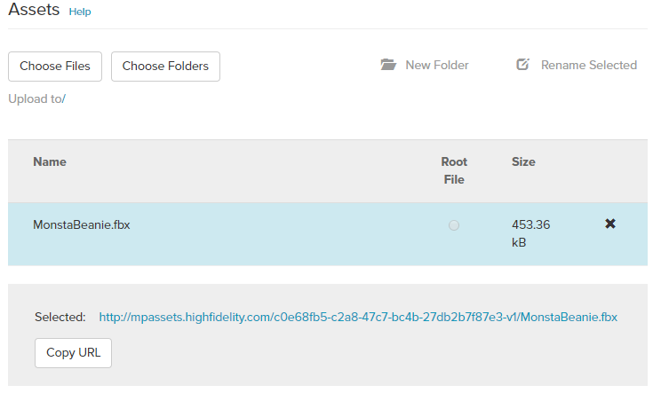
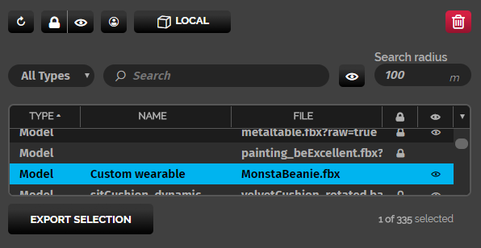

## Overview

High Fidelity allows users to create wearables for their avatar, which can include hats, glasses, and even companion pets can be uploaded as a wearable. Wearables attach to avatars through a JSON file that fixes the wearable to a specific joint. In this tutorial, we will walk you through how to edit, upload, and sell a wearable.

There are 5 steps to create and upload your own wearable:
##### 1. [Create 3D model in an external program and export](https://docs.highfidelity.com/high-fidelity-commerce/createandsellwearables#1-create-3d-model-in-an-external-program-export-and-add-the-mode)
##### 2. [Import the model in-world](https://docs.highfidelity.com/high-fidelity-commerce/avatar-wearables/createandsellwearables#2-import-the-model-in-world-1)
##### 3. [Edit the wearable](https://docs.highfidelity.com/high-fidelity-commerce/avatar-wearables/createandsellwearables#3-edit-the-wearable-1)
##### 4. [Generate a JSON to add to the Marketplace](https://docs.highfidelity.com/high-fidelity-commerce/avatar-wearables/createandsellwearables#4-generate-a-json-to-add-to-the-marketplace-1)
##### 5. [Upload the model to the Marketplace](https://docs.highfidelity.com/high-fidelity-commerce/avatar-wearables/createandsellwearables#5-upload-the-model-to-the-marketplace-1)

### 1. Create 3D model in an external program, export, and add the model to the Marketplace
The first step in creating your wearable is creating or finding a model you want to upload. 

There are a few different applications you can use to manipulate and edit your 3D model, including:
* [Blender](https://www.blender.org/)
* [Google Blocks](https://vr.google.com/blocks/)
* [Maya](https://www.autodesk.com/products/maya/overview)
* [Oculus’ Medium](https://www.oculus.com/medium/)
* [Tiltbrush](https://www.tiltbrush.com/)

Once you're done editing your model, export the file as an .fbx or .obj.
Then, upload that file into the Marketplace. 
1. Open the [Marketplace](https://highfidelity.com/marketplace) from your browser and login to your account.
2. Click **New Submission** under your username in the righthand corner. 
3. Add the model's name, description, price, image, and set the category to **Wearable**. Make sure to correctly attribute the model to the owner if you used a template.
4. Click **Save & Continue**
5. Upload the model's .obj or.fbx file under **Assets**.
6. Click on the uploaded file and click **Copy URL** (this will be necessary for step 2).


### 2. Import the model in-world
You can import your model into High Fidelity using the Avatar app.

Simply open up the Avatar menu, click the hat button to open up the Wearables app, click **Add Custom**, and paste the URL from step 1 in the text box and click **Confirm**.
Then click the joint you'd like the wearable to attach to and click **Save**.


### 3. Edit the wearable
Once imported, use the Create app to edit the object as you’d like. Using the Create tools, you can give your wearable more depth, height or angle it differently.

If you're creating a wearable to add to the Marketplace, make sure it will fit the default wooden mannequin avatar (unless you are specifically making it to go with a very specific base avatar model). This will ensure that the wearable will work with most avatars in High Fidelity. 

### 4. Generate a JSON to add to the Marketplace
To generate the wearable's JSON file, simply open up the entity list, click on the wearable you'd like to export and click **Export Selection** at the bottom of the window. Specify a file location and name, then export the file.


Sample Marketplace JSON for "MonstaBeanie": 

```
{
  "DataVersion": 0,
  "Entities": [
    {
    "id": "{0afcbec9-b9f8-480a-8f23-9e19c6fa2121}",
    "type": "Model",
    "created": "2019-01-03T17:30:15Z",
    "lastEdited": 1546536628255544,
    "lastEditedBy": "{cf8ed878-8cb3-467c-af87-ae0d60178494}",
    "position": {
        "x": -4.172325134277344e-7,
        "y": -2.384185791015625e-7,
        "z": 0.0000019073486328125
    },
    "dimensions": {
        "x": 0.25441086292266846,
        "y": 0.266787052154541,
        "z": 0.284202516078949
    },
    "rotation": {
        "x": 0,
        "y": 0,
        "z": 0,
        "w": 1.0000001192092896
    },
    "name": "Custom wearable",
    "modelURL": "http://mpassets.highfidelity.com/c0e68fb5-c2a8-47c7-bc4b-27db2b7f87e3-v1/MonstaBeanie.fbx",
    "parentID": "{00000000-0000-0000-0000-000000000001}",
    "parentJointIndex": 66,
    "queryAACube": {
        "x": 46.20293045043945,
        "y": -0.46973875164985657,
        "z": -36.87148666381836,
        "scale": 1.3964389562606812
    },
    "entityHostType": "avatar",
    "owningAvatarID": "{cf8ed878-8cb3-467c-af87-ae0d60178494}",
    "clientOnly": true,
    "avatarEntity": true,
    "localEntity": false
}
    ],
  "Id": "{c8e95263-bda8-45f7-96c2-5f8e6694fdb7}",
  "Version": 98
}
```

#### 5. Upload the model to the Marketplace
* Open the [Marketplace](https://highfidelity.com/marketplace) from your browser again.
* Open the draft you started in Step 1 by going to **My Submissions**. 
* Then, open your item again and click **Edit**.
* Upload the model's JSON under **Assets**.
>>>>> Note: You can copy the JSON's URL under Assets and import that into to High Fidelity to test your wearable. 
* At the bottom of the screen, click **I agree to the Marketplace Terms of Use and to the conditions above** and then **Submit For Review**.

